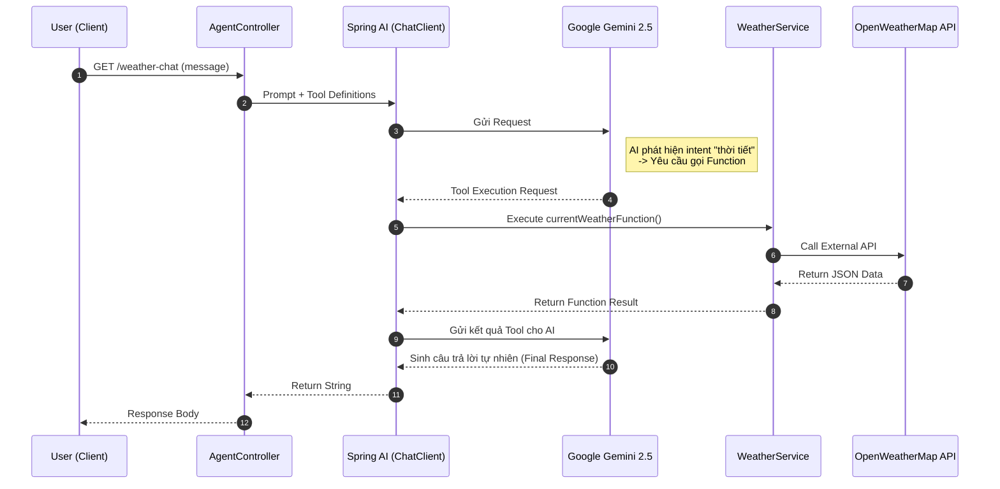
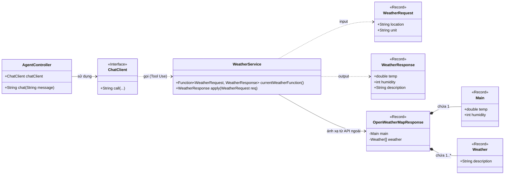

## 🏗️ 1. Kiến trúc hệ thống (Architecture Flow)

Dưới đây là luồng xử lý request khi người dùng hỏi về thời tiết:
### Sequence Diagram

### Flowchart

### Class Diagram

## 🚀 2. Yêu cầu hệ thống (Prerequisites)

### 💻 Môi trường (Development Environment)
- [x] **Java:** JDK 17+
- [x] **Build Tool:** Maven / Gradle
- [x] **IDE:** IntelliJ IDEA (Recommended) / VS Code / Eclipse

### 🗝️ API Keys Required
Để chạy được Agent, bạn cần chuẩn bị 2 keys sau (sau đó thay vào file application.properties):

| Service | Mô tả | Đăng ký tại |
| :--- | :--- | :--- |
| **Google Gemini** | Dùng làm "bộ não" AI cho Agent | [Google AI Studio ↗](https://aistudio.google.com/) |
| **OpenWeatherMap** | Cung cấp dữ liệu thời tiết thực tế | [OpenWeatherMap ↗](https://openweathermap.org/) |

> **⚠️ Lưu ý:**
> * Đối với **OpenWeatherMap**: Sau khi tạo key mới, có thể mất từ 10-15 phút để key được kích hoạt.
> * Hãy bảo mật API Key của bạn, không commit trực tiếp lên Github (sử dụng biến môi trường hoặc file properties).
