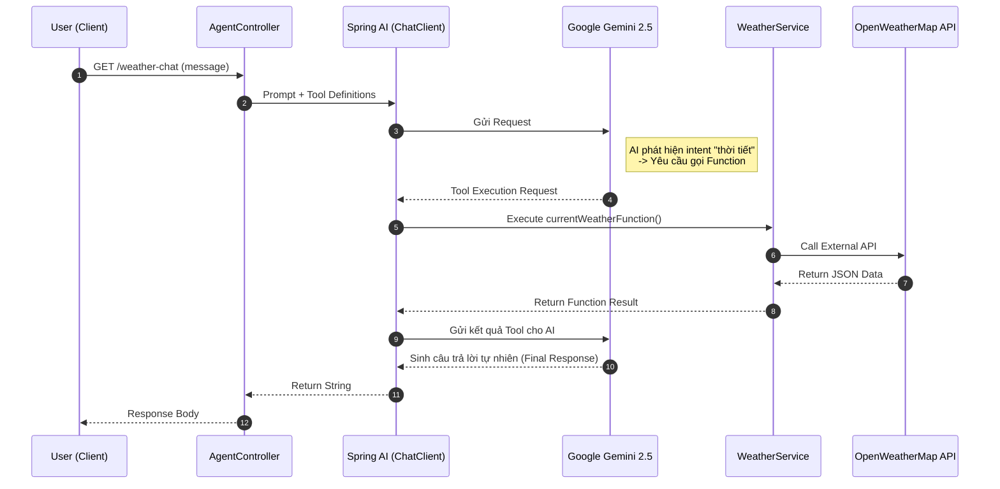

## 🏗️ Kiến trúc hệ thống (Architecture Flow)

Dưới đây là luồng xử lý request khi người dùng hỏi về thời tiết:

```mermaid
sequenceDiagram
    autonumber
    participant User as User (Client)
    participant Controller as AgentController
    participant SpringAI as Spring AI (ChatClient)
    participant Gemini as Google Gemini 2.5
    participant Tool as WeatherService
    participant OWM as OpenWeatherMap API

    User->>Controller: GET /weather-chat (message)
    Controller->>SpringAI: Prompt + Tool Definitions
    SpringAI->>Gemini: Gửi Request
    
    Note right of Gemini: AI phát hiện intent "thời tiết"<br/>-> Yêu cầu gọi Function
    
    Gemini-->>SpringAI: Tool Execution Request
    SpringAI->>Tool: Execute currentWeatherFunction()
    Tool->>OWM: Call External API
    OWM-->>Tool: Return JSON Data
    Tool-->>SpringAI: Return Function Result
    
    SpringAI->>Gemini: Gửi kết quả Tool cho AI
    Gemini-->>SpringAI: Sinh câu trả lời tự nhiên (Final Response)
    SpringAI-->>Controller: Return String
    Controller-->>User: Response Body
```
