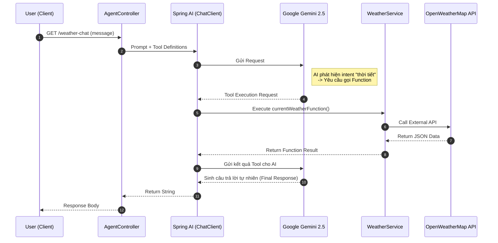
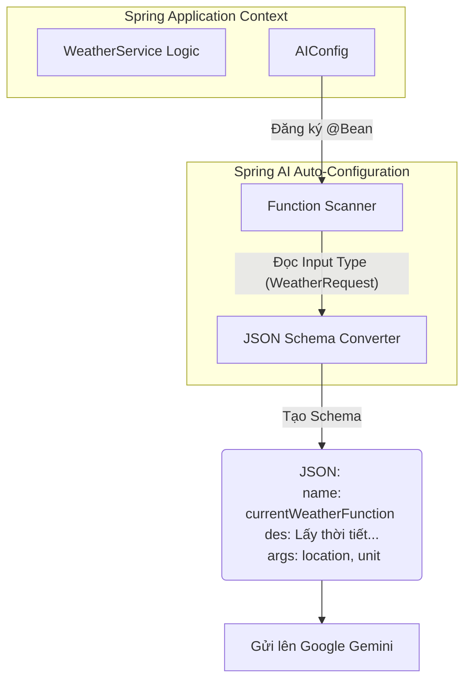

## 🏗️ 1. Kiến trúc hệ thống (Architecture Flow)

Dưới đây là luồng xử lý request khi người dùng hỏi về thời tiết:
### Sequence Diagram

### Flowchart

### Class Diagram

### AIConfig Flow
A. @Configuration
Ý nghĩa: Báo cho Spring Boot biết class này chứa các bản thiết kế (blueprints) để tạo ra các Bean.

Vai trò: Nơi tập trung cấu hình, giúp code gọn gàng thay vì rải rác khắp nơi.

B. @Bean (Cốt lõi vấn đề)
Trong Spring thường: Nó chỉ đơn giản là đưa đối tượng vào thùng chứa (ApplicationContext) để tái sử dụng.

Trong Spring AI: Đây là công tắc kích hoạt. Spring AI có một cơ chế tự động quét (scan). Bất cứ khi nào nó thấy một @Bean trả về kiểu Function<T, R>, nó sẽ tự hiểu:

"À, đây không phải bean thường. Đây là một Tool mà mình cần giới thiệu cho AI (Gemini/ChatGPT) biết."

C. Tên phương thức currentWeatherFunction
Ý nghĩa: Đây chính là Tên công cụ (Tool Name) mà Gemini nhìn thấy.

Lưu ý: Nếu bạn đổi tên hàm này thành abcXYZ(), thì trong file JSON gửi lên Google, tên tool cũng sẽ đổi thành abcXYZ.

Lời khuyên: Hãy đặt tên rõ ràng, dùng động từ (ví dụ: getWeather, searchProduct) để AI dễ hiểu mục đích.

D. @Description (Rất quan trọng)
Ý nghĩa: Đây là Bảng hướng dẫn sử dụng cho AI.

Cơ chế: Dòng chữ "Lấy thông tin thời tiết..." sẽ được gửi kèm prompt lên Gemini.

Tại sao cần? Nếu không có mô tả này, AI chỉ thấy tên hàm currentWeatherFunction và phải đoán mò. Có mô tả, AI sẽ biết chính xác khi nào nên dùng tool này.

E. Function<WeatherRequest, WeatherResponse>
Ý nghĩa: Định nghĩa "Cổng vào" (Input) và "Cổng ra" (Output).

Magic của Spring AI: Dựa vào generic type <WeatherRequest>, Spring AI sẽ dùng Reflection để đọc Record WeatherRequest, xem nó có trường location, unit... và tự động vẽ ra file JSON Schema để gửi cho Gemini. Bạn không cần viết một dòng JSON nào cả!

## 🚀 2. Yêu cầu hệ thống (Prerequisites)

### 💻 Môi trường (Development Environment)
- [x] **Java:** JDK 17+
- [x] **Build Tool:** Maven / Gradle
- [x] **IDE:** IntelliJ IDEA (Recommended) / VS Code / Eclipse

## 📝 Giải Thích Thuật Ngữ Java Hiện Đại

Dự án này sử dụng các tính năng mới từ Java 17+ (LTS) và Spring Boot 3.x. Dưới đây là giải thích các khái niệm mà có thể bạn chưa quen thuộc:

### 1. Record (Java DTO Kiểu Mới)
* **Vấn đề cũ (Java 7):** Để tạo một đối tượng truyền dữ liệu (DTO) sạch sẽ, bạn phải viết thủ công Class, Private Fields, Constructor, Getters, `equals()`, `hashCode()`, và `toString()`. Rất nhiều code thừa (Boilerplate).
* **Giải pháp (Record):** Record là một `class` rút gọn. Khi bạn khai báo `public record WeatherRequest(String location, String unit) {}`, Java Compiler sẽ **tự động sinh ra** tất cả các hàm cần thiết cho bạn.
* **Mục đích:** Giúp code sạch, gọn gàng và đảm bảo dữ liệu luôn bất biến (immutable).

### 2. Function<T, R> (Functional Interface)
* `Function<T, R>` là một Interface chuẩn của Java 8+. Nó định nghĩa một "hàm" nhận vào một đối số kiểu `T` và trả về một kết quả kiểu `R`.
* Trong dự án, `WeatherService implements Function<WeatherRequest, WeatherResponse>` có nghĩa là: **"WeatherService là một hàm nhận input là `WeatherRequest` và trả về output là `WeatherResponse`."**

### 3. Annotation @Bean và Tool Calling (Cốt lõi của AI Agent)
* Trong các dự án AI Agent hiện đại, chúng ta không gọi code Java trực tiếp. **AI Agent quyết định khi nào gọi.**
* Khi bạn dùng `@Bean` trên một `Function<T, R>`, bạn đang báo với Spring AI rằng:
    * **"Đây là một công cụ (Tool) có sẵn."**
    * **"Gemini có thể gọi công cụ này bằng tên phương thức."**
* **Ví dụ:** Tên Bean `currentWeatherFunction` chính là tên mà AI Agent dùng để ra lệnh cho hệ thống của bạn. Backend (Code Java) chỉ là "tay chân" làm theo lệnh của AI.

### 🗝️ API Keys Required
Để chạy được Agent, bạn cần chuẩn bị 2 keys sau (sau đó thay vào file application.properties):

| Service | Mô tả | Đăng ký tại |
| :--- | :--- | :--- |
| **Google Gemini** | Dùng làm "bộ não" AI cho Agent | [Google AI Studio ↗](https://aistudio.google.com/) |
| **OpenWeatherMap** | Cung cấp dữ liệu thời tiết thực tế | [OpenWeatherMap ↗](https://openweathermap.org/) |

> **⚠️ Lưu ý:**
> * Đối với **OpenWeatherMap**: Sau khi tạo key mới, có thể mất từ 10-15 phút để key được kích hoạt.
> * Hãy bảo mật API Key của bạn, không commit trực tiếp lên Github (sử dụng biến môi trường hoặc file properties).
